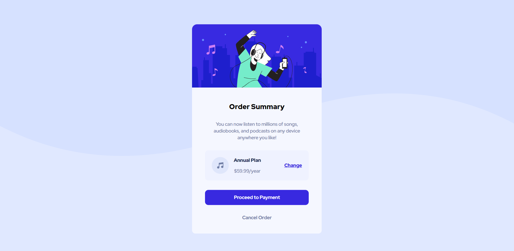

# Frontend Mentor - Order Summary Component

This is a solution to the [Order Summary Component challenge on Frontend Mentor](https://www.frontendmentor.io/challenges/order-summary-component-QlPmajDUj). Frontend Mentor challenges help you improve your coding skills by building realistic projects. 

## Table of contents

- [Overview](#overview)
  - [The challenge](#the-challenge)
  - [Screenshot](#screenshot)
  - [Links](#links)
- [My process](#my-process)
  - [Built with](#built-with)
- [Front-end Style Guide](#front-end-style-guide)  
  - [Layout](#layout)
  - [colors](#colors)  
- [font](#font)  
  - [Continued development](#continued-development)
  - [Useful resources](#useful-resources)
- [Author](#author)

## Overview

### The challenge

Users should be able to:

- View the optimal layout depending on their device's screen size

### Screenshot

### Links

- Solution URL: [Github](https://github.com/FuhadRaheem/order-summary-component)

## My process

### Built with

- Mobile-first workflow
- HTML
- CSS

# Front-end Style Guide

## Layout

The designs were created to the following widths:

- Mobile: 375px
- Desktop: 1440px

## Colors

### Primary

- Pale blue: hsl(225, 100%, 94%)
- Bright blue: hsl(245, 75%, 52%)

### Neutral

- Very pale blue: hsl(225, 100%, 98%)
- Desaturated blue: hsl(224, 23%, 55%)
- Dark blue: hsl(223, 47%, 23%)

## Typography

### Body Copy

- Font size (paragraph): 16px

### Font

- Family: [Red Hat Display](https://fonts.google.com/specimen/Red+Hat+Display)
- Weights: 500, 700, 900

### Continued development

I would like to improve my JS and css code, learn more about css (flexbox, grid, etc.) and better structure the html

### Useful resources

- See projects on gihub

## Author

- Frontend Mentor - [@FuhadRaheem](https://www.frontendmentor.io/profile/FuhadRaheem)